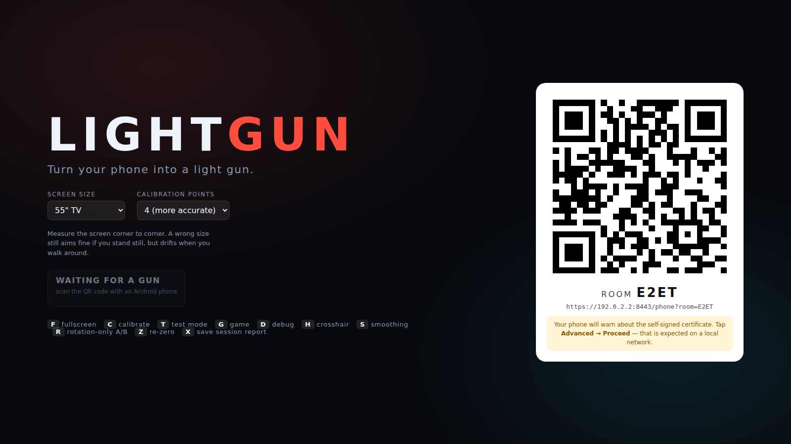

# LIGHTGUN

**Turn your phone into a light gun. Turn any TV into an arcade.**

No console. No emulator. No ROMs. No IR sensor bar. No dedicated hardware.
A browser on the TV, an Android phone in your hand, and a QR code between them.



---

## Run it

```bash
cd lightgun
npm install
npm start
```

Then:

1. On the laptop plugged into the TV, open **http://localhost:8080/** and press **F** for fullscreen.
2. Pick your screen size in the dropdown (measure the diagonal — it matters, see below).
3. Scan the QR code with an Android phone on the same Wi-Fi.
4. The phone warns about the self-signed certificate → **Advanced → Proceed**. This is expected: WebXR
   refuses to run over plain HTTP, so the server mints a local certificate for your LAN address.
5. Tap **START GUN**, grant the camera prompt.
6. Point at each marker the TV shows and pull the trigger. Four points, about ten seconds.
7. **READY → 3 → 2 → 1 → GO.**

Press **T** for the light-gun test rig, **G** for the game, **C** to recalibrate, **D** for diagnostics,
**Z** to re-zero after drift, **X** to save a session report — it downloads *and* copies itself to
your clipboard, so testing is "press X, paste" rather than transcribing numbers off a TV — and **V**
to pull the phone's raw ARCore pose trace for offline analysis.

**Requirements:** an Android phone with Google Play Services for AR (ARCore), Chrome, on the same
network as the laptop. Phones without ARCore fall back to a rotation-only mode that works but drifts.

---

## How the aiming works

The phone runs a **WebXR `immersive-ar` session**, which on Android Chrome is ARCore underneath. That
gives visual-inertial 6DoF tracking: camera features pin the yaw that a gyroscope alone would let
drift. We never draw anything into the AR session — we only want the device pose, and the entire gun
UI is a DOM overlay on top of it.

Calibration solves a small geometry problem rather than asking the player to understand any of it:

1. The TV draws a marker at each corner of a rectangle inset slightly inside the screen edge.
2. Each trigger pull captures an **aiming ray** — the phone's position and its camera's forward axis,
   averaged over 220 ms to shed hand tremor.
3. Knowing the physical size of that rectangle (from the screen size you picked), we solve for how far
   along each ray the corner sits. Four rays, four unknowns, seven constraints — four edge lengths and
   a parallelogram closure — fitted with Levenberg–Marquardt.
4. That yields the TV as a plane with a known origin and axes in ARCore world space.
5. From then on, aiming is a ray-plane intersection, converted to normalised screen coordinates and
   sent to the display at frame rate.

**Why the screen size question matters:** it is what pins metric scale. Get it wrong and aiming is
still fine while you stand still, but parallax is wrong when you move — measured at 19% of screen
width if you say 43" for a 55" TV and then take a step. Get it right and stepping 0.9 m costs you
0.6%.

**Why not gyro-only:** we implemented it too, as a fallback and as a control. From a fixed viewpoint
it is mathematically exact (a plane seen through a rotating camera is just a homography). Step 0.9 m
sideways without recalibrating and its error goes to **~50% of screen width**, versus **0.6%** for the
6DoF path. That is the whole argument for the camera.

---

## What's here

| Path | What it is |
|---|---|
| `display/` | The TV client: pairing, calibration choreography, test rig, game, diagnostics |
| `phone/` | The controller: WebXR pose, calibration capture, trigger, haptics |
| `shared/` | The aiming maths and the network wrapper — identical code on both ends and in the tests |
| `server/` | ~200 lines: static files, a QR endpoint, and a dumb WebSocket room relay |
| `tools/` | Offline trace analysis: real sensor noise, drift, and a smoothing sweep on real data |
| `tests/` | Synthetic-truth maths tests and a headless end-to-end run with a simulated gun |
| `docs/` | Architecture, testing protocol, screenshots |

Read next: **[PROGRESS.md](PROGRESS.md)** for state and measurements, **[ARCHITECTURE.md](ARCHITECTURE.md)**
for the decisions and why, **[TESTING.md](TESTING.md)** for the protocol to run against a real TV.

---

## Tests

```bash
npm test          # aiming maths against synthetic ground truth
npm run test:e2e  # headless Chromium display + a simulated 6DoF phone (needs the server running)
```

The e2e test is not a mock of the protocol — it runs the real display client in a browser and drives it
with a virtual player standing 2.6 m from a virtual 55" TV, using the same shared solver the phone
uses. It measures calibration error, hit accuracy, packet rate and latency over a real WebSocket.

---

## Status, honestly

The pipeline is proven in simulation and end to end in a browser. **It has not yet been fired at a
real TV by a real hand**, because that needs an Android phone this environment does not have. That
test is the one that matters and it is written up ready to run in [TESTING.md](TESTING.md).

---

## Content

All artwork is drawn from primitives in `display/js/game.js` and `display/js/render.js`. Nothing is
imported, traced or derived from any existing game.

MIT licensed, like the rest of this repository.
