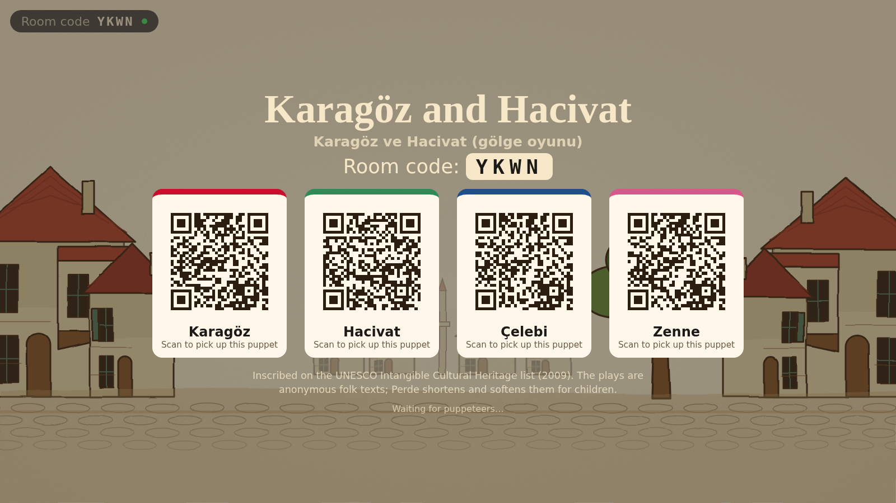
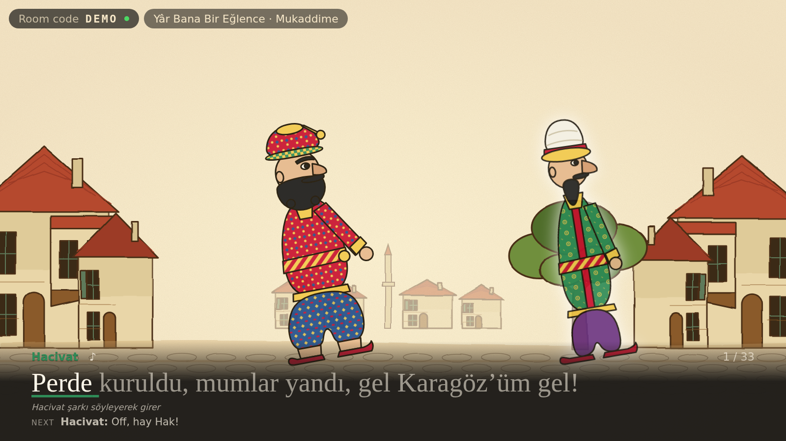
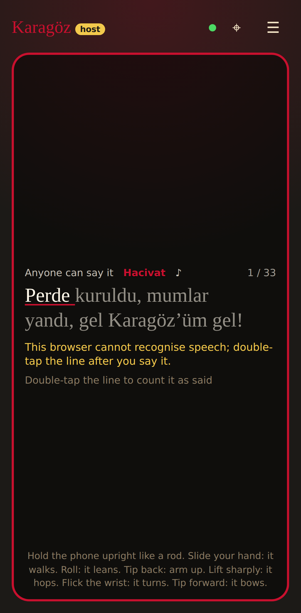
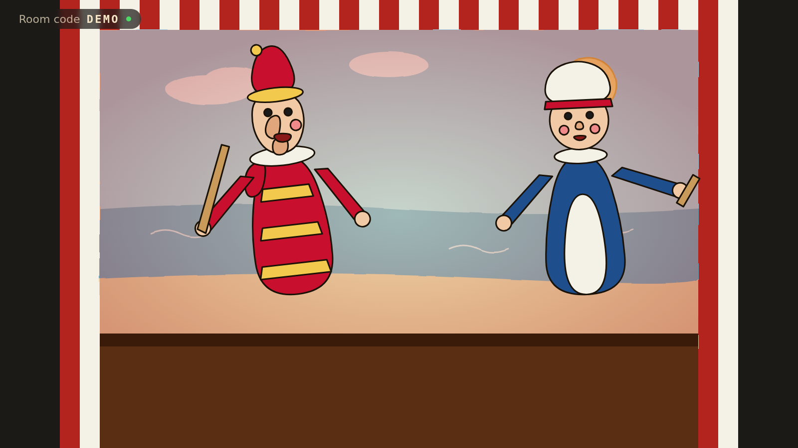

# Perde

**Karagöz ile Hacivat televizyonda, ipler senin telefonunda.**
_Karagöz and Hacivat on your TV, the strings in your phone._

Televizyonda bir tarayıcı açarsın, iki telefon kare kodu okutur. Telefonu eğdikçe perdedeki
Karagöz eğilir, salladıkça zıplar. Altta replikler karaoke gibi akar; telefon söylediğini duyar,
doğru söyleyince sıradaki repliğe geçer. Karagöz oyunlarının yanına başka geleneklerin kuklaları da
gelir: Punch and Judy hazır, Wayang Kulit ve Kasperle sırada.

| TV: lobi ve kare kodlar                    | TV: oyun                                 |
| ------------------------------------------ | ---------------------------------------- |
|  |  |

| Telefon: kumanda                                                                       | Başka bir gelenek: Punch and Judy            |
| -------------------------------------------------------------------------------------- | -------------------------------------------- |
|  |  |

## Nasıl çalışır

1. **Televizyonda aç** — `/stage`. Ekranda oda kodu ve her kukla için bir kare kod çıkar.
2. **Telefonla okut** — `/join?room=ABCD&seat=p1`. "Kuklayı eline al" de, hareket sensörüne izin ver.
3. **Oyna ve söyle** — Host telefon menüden oyun seçer. Sıra sendeyken repliği söyle; kelimeler
   yeşile döndükçe perde ilerler. Konuşma tanıma yoksa "Söyledim" düğmesi var.

Uygulama yüklemek yok; TV'de tarayıcı, telefonda kamera yeter. Dört telefona kadar. Boş kalan
karakterleri perde kendi oynatır ve **televizyon seslendirir**; sıradaki replik altta görünür.

**Kendi kuklanı çiz** — `/draw`. Kâğıda çiz, fotoğrafını çek; kâğıt telefonda silinir, eklemlere
dokunursun (tahmin hazır gelir), baş-kol-bacak rig'lenir, çizim sahneye gider ve istediği rolü
oynar. Çizimler telefonda kalır, girdiğin her televizyona gelir.

Görsel: parşömen dokusu, mürekkep çizgili Osmanlı sokağı, desenli boyalı deri kaftanlar; Canva
ile üretilmiş tasvir sanatı `docs/ART.md` ile eklenince kuklalar boyalı hale gelir.

## Hızlı başlangıç

```bash
pnpm install
pnpm build            # apps/web → dist
pnpm dev:relay        # http://127.0.0.1:8787 (relay + statik dosyalar, workerd)
# ikinci terminal, canlı yeniden yükleme istersen:
pnpm dev:web          # http://localhost:5173 (/api → 8787'e proxy)
```

Telefonla denemek için bilgisayar ve telefon aynı Wi‑Fi'da olsun; `pnpm dev:web` ağa açıktır
(`--host`). iOS hareket sensörü **HTTPS** ister; yerelde `wrangler dev --local-protocol https` ya da
bir tünel (cloudflared) kullan. Üretimde Cloudflare zaten HTTPS.

```bash
pnpm verify           # typecheck + lint + unit + build (CI ile aynı)
pnpm e2e              # Playwright, gerçek relay'e karşı
pnpm metrics          # docs/PROGRESS.md'yi günceller
pnpm screenshots      # docs/screenshots/*.png (relay çalışırken)
pnpm deploy           # Cloudflare Workers (docs/DEPLOY.md)
```

## Yapı

```
perde/
├── apps/web        Vite + React: /, /stage (TV), /join (telefon)
├── apps/relay      Cloudflare Worker + Durable Object oda relay'i; web'i statik servis eder
├── packages/shared protokol (zod), oyun/kukla şemaları, replik eşleştirici, oda mantığı
├── packages/content kültür paketleri: tr (Karagöz), en (Punch and Judy)
├── e2e             Playwright duman testleri
├── scripts         metrics.ts, screenshots.mjs, extract-to-own-repo.sh
├── docs            VISION · ARCHITECTURE · ROADMAP · METRICS · PROGRESS · PRICING · DEPLOY · CONTENT_GUIDE
└── .claude         skills (/status, /add-play, /add-puppet, /add-culture, /ship, /playtest, /steward)
```

Belgeler: [VISION](docs/VISION.md) · [ARCHITECTURE](docs/ARCHITECTURE.md) · [ROADMAP](docs/ROADMAP.md) ·
[METRICS](docs/METRICS.md) · [PROGRESS](docs/PROGRESS.md) · [PRICING](docs/PRICING.md) ·
[DEPLOY](docs/DEPLOY.md) · [CONTENT_GUIDE](docs/CONTENT_GUIDE.md) · [kararlar](docs/decisions/)

Claude Code ile çalışıyorsan [CLAUDE.md](CLAUDE.md) başlangıç noktası.

---

## English

Open a browser on the TV, scan a QR code with each phone. Tilt the phone and the puppet leans;
flick it and it hops. The script scrolls along the bottom like karaoke; the phone hears you and,
when you say the line, the play moves on. Karagöz and Hacivat ship first; Punch and Judy is in;
Wayang Kulit and Kasperle are next as content packs.

Everything above applies: `pnpm install && pnpm build && pnpm dev:relay`, then `/stage` on the
TV and `/join` on the phones. iOS motion sensors need HTTPS. See the docs linked above.

## Licence

Source: [PolyForm Noncommercial 1.0.0](LICENSE). Play texts are original child-friendly
adaptations of anonymous folk plays; the traditional sources are public domain.
